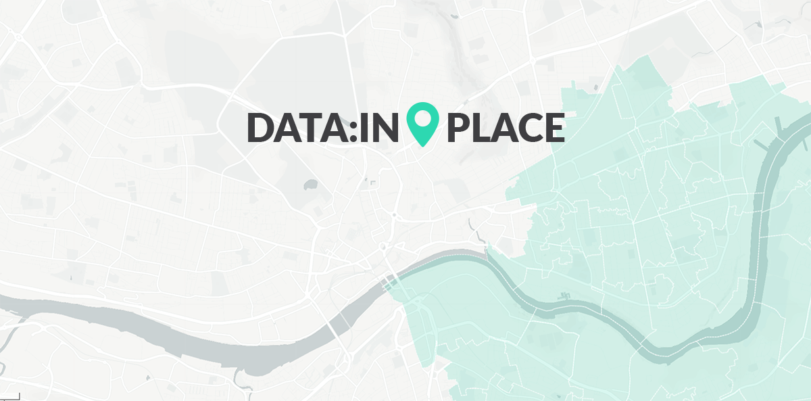

## About

[](https://opensource.org/licenses/MIT)

**data-in.place** is an open source geographic information system (GIS) for accessing and visualising open data. It leverages an open source web tool [RAWGraphs](http://rawgraphs.io/) (originally forked) by by [DensityDesign Research Lab](http://www.densitydesign.org/) ([Politecnico di Milano](http://www.polimi.it/)), [Calibro](http://calib.ro/) and [INMAGIK](https://inmagik.com/).

This tool is currently maintained by [Aare Puussaar](https://github.com/aarepuu).

System connects to real time open governmental datasources / APIs (e.g., Office of National Statistics, Home Office, NHS, Department of Education, Ministry of Housing, Communities and Local Government etc. in the UK) and provides a interface for making place based queries. Instead of writing complex queries or scrolling through endless lists of tables to get the relevant data you need, you can use the map to focus on a specific area (i.e. draw a boundary on a map. Also by zooming in and out the area, the system displays statistics on different administration level (i.e. output areas, wards, local authorities, counties and countries in the UK).

data-in.place aims to make open data accessible and usable for non-professionals.

It also enables you to add your own datasets from different sources - pasting as text, from a file or from an url. System automatically then finds any geographical information (e.g. longitude and latitude, postcodes, official country specific codes) from your data and outputs it onto the map. This feature of the system gives the ability to overlay and intersect datasets (e.g. geographic surveys, local consultation data) collected by the community or other groups with the open datasets.

data-in.place also enables you to request open datasets to be added to the platform and linked to the map based query system.

- App page: [app.data-in.place](https://app.data-in.place)
- Project official page: [data-in.place](http://data-in.place)
- Documentation: [github.com/aarepuu/data-in.place/wiki](https://github.com/aarepuu/data-in.place/wiki)

## Usage

The easiest way to use data-in.place is by accessing the most updated version on the **[official app page](https://app.data-in.place)**. However, data-in.place can also run locally on your machine: see the installation instructions below to know how.

## Installation

If you want to run your instance of data-in.place locally on your machine, be sure you have the following requirements installed.

### Requirements

- [Git](https://git-scm.com/book/en/v2/Getting-Started-Installing-Git) (it could be used through the interface of [GitHub Desktop](https://desktop.github.com/))
- [Node.js](https://nodejs.org/en/)
- [Yarn](https://yarnpkg.com/getting-started/install)
- [MapBox](https://account.mapbox.com/) (this is used as a Map API)

### Instructions

Clone data-in.place from the command line:

```shell
git clone https://github.com/aarepuu/data-in.place.git
```

browse to data-in.place root folder:

```shell
cd data-in.place
```

set `.env` variables:

```shell
cp .env.example .env # need to add your own https://mapbox.com/ api key
```

set `configuration` for map and datasources:

```shell
cp config/dataSources.json.example config/dataSources.json # datasource links
cp config/geom.js.example config/geom.js # geom configurations
```

Read more about how to configure datasources and mapping from the [Developer Guide](https://github.com/aarepuu/data-in.place/wiki/Developer-Guide)

Install the needed dependencies through Yarn:

```shell
yarn install
```

Now you can run the project locally in development mode with the command:

```shell
yarn start
```

Once this is running, go to [http://localhost:3000/](http://localhost:3000/).

You can also build your own version and upload it on your server by running the command:

```shell
yarn build
```

### Customisation

Out of the box version is running the app that can be used for UK. To change it to work with other countries official data there is couple of parameters that need to be set.

For setting up ArcGIS MapServer parameters for a particular country (geographical areas) there is a need to modify
[src/geom.js](geom.js) constants file.

Additionally new datasources need to be added to [public/dataSources.json](dataSources.json) that correspond to a particular country/area. File has example data enpoints for UK Official Statistics.

## Documentation and Support

Coming soon...

## Contributing

Want to contribute to data-in.place development or report issues? Feel free to fork the project, submit issues and pull requests.
For more information you can write to us at <hello@data-in.place>.

## RAWGraphs

This data-in.place tool is an extension of RAWGraphs and originally "Forked" from [https://github.com/rawgraphs/rawgraphs-app](RAWGraphs), however it is no longer connected to its source.
If you would like to contribute to development of RAWGraps you can fork their software from [https://github.com/rawgraphs/rawgraphs-app](here).

Documentation and FAQs about how to use RAWGraphs can be found on the [wiki](https://github.com/rawgraphs/rawgraphs-app/wiki).
Information about the available charts can be found [here](https://github.com/rawgraphs/rawgraphs-app/wiki/Available-Charts). For more information about adding or editing layouts, see the [Developer Guide](https://github.com/rawgraphs/rawgraphs-app/wiki/Developer-Guide).

## Licenses

data-in.place is provided under [MIT](https://github.com/aarepuu/data-in.place/blob/master/LICENSE):

    Copyright (c), 2016-2021 Aare Puussaar, <hello@data-in.place>

    Licensed under the MIT License (the "License"); you may not use this file except in compliance with the License.
    You may obtain a copy of the License at

    	https://opensource.org/licenses/MIT

    Unless required by applicable law or agreed to in writing, software distributed under the License is distributed on an "AS IS" BASIS, WITHOUT WARRANTIES OR CONDITIONS OF ANY KIND, either express or implied.
    See the License for the specific language governing permissions and limitations under the License.

RAWGraphs is provided under the [Apache License 2.0](https://github.com/rawgraphs/rawgraphs-app/blob/master/LICENSE):

    Copyright (c), 2013-2021 DensityDesign Lab, Calibro, INMAGIK <hello@rawgraphs.io>

    Licensed under the Apache License, Version 2.0 (the "License"); you may not use this file except in compliance with the License.
    You may obtain a copy of the License at

    	http://www.apache.org/licenses/LICENSE-2.0

    Unless required by applicable law or agreed to in writing, software distributed under the License is distributed on an "AS IS" BASIS, WITHOUT WARRANTIES OR CONDITIONS OF ANY KIND, either express or implied.
    See the License for the specific language governing permissions and limitations under the License.
